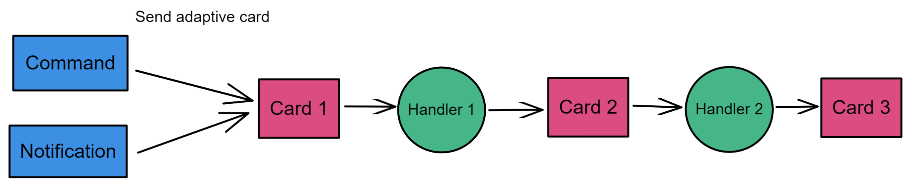
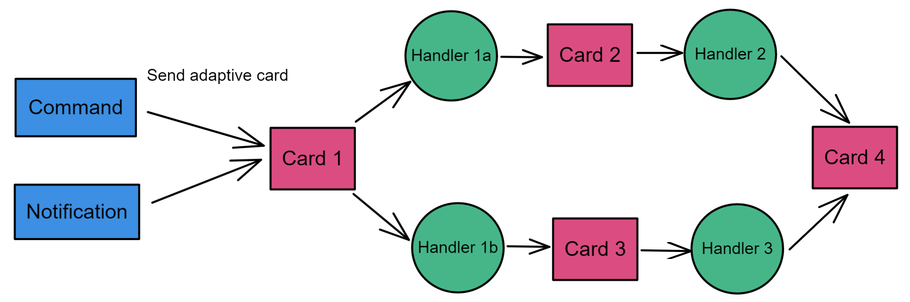
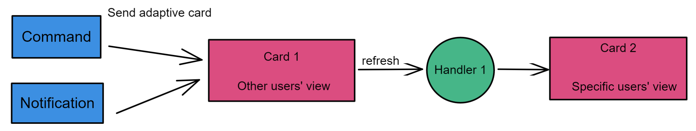

# Bot Workflow

Using Bot Workflow, Adaptive Cards are updated on user action and user can progress through a series of cards that require user input.  

## Pattern #1: Card Action Chaining
In the card action chaining pattern, a sequence of adaptive card actions is executed in a specific order. In this pattern, the card action output of one card is applied to the card action input of another card. 



You can use TeamsFx SDK to implement the card action chaining pattern concisely as shown in this example. 

In this example, the adaptive card `Card 1` can be sent by command bot or notification bot. When the action defined in `Card 1` is executed by users, the card action handler `Handler 1` will be triggered and return another card `Card 2`. Then the existing `Card 1` will be replaced by `Card 2`. Similarly, `Card 3` will be returned once the action defined in `Card 2` is executed. 

### Step 1: add an action to your Adaptive Card 

Here`s the sample action defined in Card 1: 
```json
{ 
  "type": "AdaptiveCard", 
  "body": [ 
    ... 
    { 
      "type": "ActionSet", 
      "actions": [ 
        { 
          "type": "Action.Execute", 
          "verb": "doAction1", 
          "title": "DoAction1" 
        } 
      ] 
    } 
  ], 
  ... 
} 
```
 

Here, `Action.Execute` invoking the bot can return Adaptive Cards as a response, which replaces the existing card in conversation.  

### Step 2: add card action handler 

In this example, another adaptive card `Card 2` is returned when `doAction1` is triggered. 

```typescript
import card2 from "../adaptiveCards/card2.json"; 

export class Handler1 implements TeamsFxBotCardActionHandler { 
    triggerVerb: string = "doAction1"; 

    async handleActionReceived(actionData: any, context: TurnContext): Promise<IAdaptiveCard | void> { 
        return AdaptiveCards.declare(card2).render(actionData); 
    } 
} 
```

Here, the actionData is the output of `Card 1` on user action and you can access the information input by the user. 

### Step 3: register the action handler 

bot/src/internal/initialize.ts 
```typescript
export const commandBot = new ConversationBot({ 
  ... 
  cardAction: { 
    enabled: true, 
    actions: [ 
      new Handler1() 
    ], 
  } 
}); 
```
 

## Pattern #2: Card Action Conditional

In the action conditional pattern, you can have multiple actions defined in one adaptive card and each action is bound with a corresponding handler to process the logic. Meanwhile, different handlers can return the same adaptive card. 



Below are the steps to implement this pattern with TeamsFx SDK. 

### Step 1: add multiple actions to your adaptive card 

Here`s the sample actions defined in Card 1: 

```json
{ 
  "type": "AdaptiveCard", 
  "body": [ 
    ... 
    { 
      "type": "ActionSet", 
      "actions": [ 
        { 
          "type": "Action.Execute", 
          "verb": "doAction1a", 
          "title": "DoAction1a" 
        }, 
        { 
          "type": "Action.Execute", 
          "verb": "doAction1b", 
          "title": "DoAction1b" 
        } 
      ] 
    } 
  ], 
  ... 
} 
```
 

### Step 2: add multiple handlers to process the corresponding card action 

Here we take Handler1a as an example and other handlers will be very similar. 

```typescript
import card2 from "../adaptiveCards/card2.json"; 

export class Handler1a implements TeamsFxBotCardActionHandler { 
    triggerVerb: string = "doAction1a"; 

    async handleActionReceived(actionData: any, context: TurnContext): Promise<IAdaptiveCard | void> { 
        return AdaptiveCards.declare(card2).render(actionData); 
    } 
} 
```
 

### Step 3: register the action handlers 

bot/src/internal/initialize.ts 

```typescript
export const commandBot = new ConversationBot({ 
  ... 
  cardAction: { 
    enabled: true, 
    actions: [ 
      new Handler1a(), 
      new Handler1b(), 
      new Handler2(), 
      new Handler3() 
    ], 
  } 
}); 
```

## Pattern #3: Card Action Auto-Refreshed

Earlier if Adaptive Cards were sent in a Teams conversation, all users would see the exact same card content. With the action auto-refreshed pattern, User Specific Views of Adaptive Cards can be provided to users. In this way, the same Adaptive Card can now refresh to a User Specific Adaptive Card. A user can progress through their workflow without modifying the card for other users. 

It provides powerful scenarios like approvals, poll creator controls, ticketing, incident management, and project management cards. 



Below are the steps to implement this pattern with TeamsFx SDK. 

### Step 1: add refresh action to your adaptive card 

Here`s the sample refresh action defined in Card 1: 

```json
{ 
  "type": "AdaptiveCard", 
  "refresh": { 
    "action": { 
      "type": "Action.Execute", 
      "title": "Refresh", 
      "verb": "auto-refresh" 
    }, 
    "userIds": [ 
      "${userID}" 
    ] 
  }, 
  "body": [ 
    ... 
  ], 
  ... 
}
```

Card 1 will be refreshed automatically to User Specific View and trigger the action for the specific users, which are defined in userIds property of refresh property of the Adaptive Card JSON. The card remains the same for other users in the conversation. 

### Step 2: add card action handler 

```typescript
import card2 from "../adaptiveCards/card2.json"; 

export class Handler1 implements TeamsFxBotCardActionHandler { 
    triggerVerb: string = "auto-refresh"; 
 
    async handleActionReceived(actionData: any, context: TurnContext): Promise<IAdaptiveCard | void> { 
        return AdaptiveCards.declare(card2).render(actionData); 
    } 
} 
```
 
### Step 3: register the action handler 

bot/src/internal/initialize.ts 
```typescript
export const commandBot = new ConversationBot({ 
  ... 
  cardAction: { 
    enabled: true, 
    actions: [ 
      new Handler1() 
    ], 
  } 
}); 
```
 
## Related Documents

- [Sample: Action Chaining Pattern](https://github.com/dooriya/WorkflowBot/tree/qinezh/draft-chaining)
- [Sample: Action Conditional Pattern](https://github.com/dooriya/WorkflowBot/tree/qinezh/draft-fan)
- [Sample: Action Auto-Refreshed Pattern](https://github.com/dooriya/WorkflowBot/tree/qinezh/draft-refresh)
- [About Bot Workflow](https://microsoftapc.sharepoint.com/:w:/t/DevDivTeamsDevXProductTeam/EcyFDXNQGqVIiqHCaRt5T4cBUDDcy7ixA0ppYdWVJCE4vw?e=TAtEzt)
