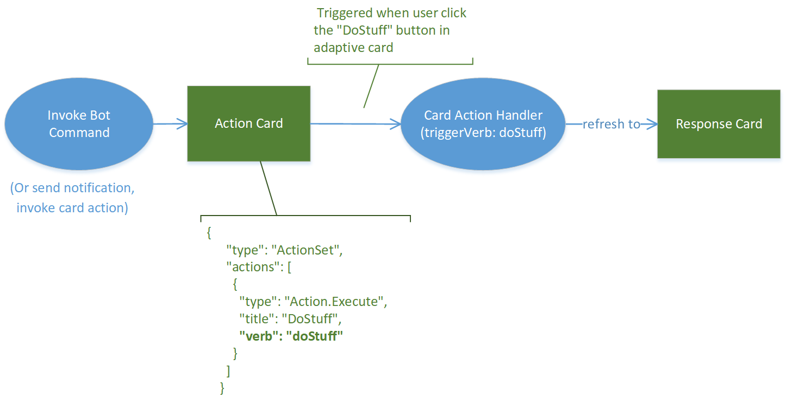

# Hello World Workflow Bot

The Adaptive Card action handler feature enables the app to respond to adaptive card actions that triggered by end users to complete a sequential workflow. 

When user gets an Adaptive Card, it can provide one or more buttons in the card to ask for user's input, do something like calling some APIs, and then send another adaptive card in conversation to response to the card action.

## Handle card action
 To simplify the development, the TeamsFx SDK provides an adaptive card action handler (`TeamsFxAdaptiveCardActionHandler`) to let developers only focus on the development of business logic to respond to the card action without learning the Bot Framework SDK.
 
### How it works?
The following diagram illustrated how to respond to a adaptive card action with TeamsFx SDK:


* `Action Card`: the card where you define your action that users can invoke (click button).
* `Response Card`: the card to respond to the action when user invoke it from the action card.
* `Card Action Handler`: triggered when user invoke the corresponding card action (its `triggerVerb` is same as the `verb` property in adaptive card action). And it will send a response card to respond to the action.

### Steps to add card action
You can use the following 4 steps to add more card action:

1. [Step 1: add an action to your Adaptive Card](#step-1-add-an-action-to-your-adaptive-card)
2. [Step 2: add adaptive card for action response](#step-2-add-adaptive-card-for-action-response)
3. [Step 3: add action handler](#step-3-add-action-handler)
4. [Step 4: register the action handler](#step-4-register-the-action-handler)

#### Step 1: add an action to your Adaptive Card

Here's a sample action with type `Action.Execute`:
```json
{ 
  "type": "AdaptiveCard", 
  "body": [
    ...
    {
      "type": "ActionSet",
      "actions": [
        {
          "type": "Action.Execute",
          "title": "DoStuff",
          "verb": "doStuff" 
        }
      ]
    }
  ]
  ... 
} 
```

`Action.Execute` invoking the bot can return Adaptive Cards as a response, which will replace the existing card in conversation by default.  

#### Step 2: add adaptive card for action response
For each action invoke, you can return a new adaptive card to display the response to end user. You can use [adaptive card designer](https://adaptivecards.io/designer/) to design your card layout according to your business needs.

To get-started, you can just create a sample card (`responseCard.json`) with the following content, and put it in `bot/src/adaptiveCards` folder:

```json
{
  "type": "AdaptiveCard",
  "body": [
    {
      "type": "TextBlock",
      "size": "Medium",
      "weight": "Bolder",
      "text": "This is a sample action response."
    }
  ],
  "$schema": "http://adaptivecards.io/schemas/adaptive-card.json",
  "version": "1.4"
}
```

#### Step 3: add action handler 

Add handler to implements `TeamsFxAdaptiveCardActionHandler` to process the logic when corresponding action is executed.

Please note:
* The `triggerVerb` is the `verb` property of your action. 
* The `actionData` is the data associated with the action, which may include dynamic user input or some contextual data provided in the `data` property of your action.
* If an Adaptive Card is returned, then the existing card will be replaced with it by default.

```typescript
import responseCard from "../adaptiveCards/responseCard.json"; 

export class Handler1 implements TeamsFxAdaptiveCardActionHandler { 
    triggerVerb = "doStuff";

    async handleActionInvoked(context: TurnContext, actionData: any): Promise<IAdaptiveCard | void> { 
        return AdaptiveCards.declare(responseCard).render(actionData); 
    } 
} 
```

> Note: you can follow [this section](#tbd-link) to customize the card action handler according to your business need. 

#### Step 4: register the action handler

1. Go to `bot/src/internal/initialize.ts`;
2. Update your `conversationBot` initialization to enable cardAction feature and add the handler to `actions` array:

```typescript
export const commandBot = new ConversationBot({ 
  ... 
  cardAction: { 
    enabled: true, 
    actions: [ 
      new Handler1() 
    ], 
  } 
}); 
```
 
## Auto-refresh to user-specific view

Earlier if Adaptive Cards were sent in a Teams channel / group chat, all users would see the exact same card content. With the introduction of [refresh model](https://docs.microsoft.com/en-us/microsoftteams/platform/task-modules-and-cards/cards/universal-actions-for-adaptive-cards/work-with-universal-actions-for-adaptive-cards#refresh-model) for Adaptive Cards Universal Action, User Specific Views can be provided to users. In this way, the same Adaptive Card can now refresh to a User Specific Adaptive Card. It provides powerful scenarios like approvals, poll creator controls, ticketing, incident management, and project management cards.

### How it works?
The following diagram illustrated how to provide user-specific view with `refresh` model:


* `Base card`: The bot sends the message with the base version of the card. This base card can be sent as a bot notification, or command response, or any card action response. All members of the conversation can view the same. The base card will be automatically refreshed to the users defined in `userIds` in the `refresh` property of the base card. 
* `Refresh behavior`: Teams clients will automatically trigger a refresh when a user views the message and the last refresh response is older than a minute. The user-specific view handler will be invoked to return a card view (`Response Card`) for specific user (`UserA`). And for other users in the conversation, they still view the base card. 

The following gif illustrated how user-specific views shows in Teams:


#### Steps to add user-specific view
Below are the steps to implement this pattern with TeamsFx SDK.

1. [Step 1: enable refresh in a base adaptive card](#step-1-enable-refresh-in-a-base-adaptive-card)
2. [Step 2: add use-specific adaptive cards](#step-2-add-use-specific-adaptive-cards)
3. [Step 3: add card action handler to refresh views](#step-3-add-card-action-handler-to-refresh-views)
4. [Step 4: register the action handler](#step-4-register-the-action-handler-1)

#### Step 1: enable refresh in a base adaptive card
As illustrated above, user-specific views are refreshed from a base card (e.g. the `card2` is refreshed from `card1`). So you need to enable `auto-refresh` on the base card (e.g. the `card1`). There're two options to achieve this:

**Option 1**: enable user-specific view refresh with SDK
The base card can be sent as a command response or a card action response. So you can enable user-specific view refresh in a `handleCommandReceived` of a command handler, or in a `handleActionInvoked` of a card action handler where the base card iss returned.

Below is a sample that a return a case card as a command response that can auto-refresh to specific user (e.g. the command sender). 
You can use the `refresh(refreshVerb, userIds, data)` method from the `@microsoft/adaptivecards-tools` library to inject a `refresh` section into your base card and need to provide the following info to define the refresh section:
- `userIds`: a set of user MRIs for who can trigger auto refresh.  For more information on how to add in userIds list in refresh section of Adaptive Card, see [fetch roster or user profile](https://docs.microsoft.com/microsoftteams/platform/bots/how-to/get-teams-context?tabs=dotnet#fetch-the-roster-or-user-profile).
- `verb`: a string to identify the refresh action.
- `data`: an optional data to associated with the refresh action.    

```typescript
import baseCard from "../adaptiveCards/baseCard.json";
import { AdaptiveCards } from "@microsoft/adaptivecards-tools"; 

export class MyCommandHandler1 implements TeamsFxBotCommandHandler {
  triggerPatterns: TriggerPatterns = "helloWorld";

  async handleCommandReceived(
    context: TurnContext,
    message: CommandMessage
  ): Promise<string | Partial<Activity> | void> {
    const refreshVerb = "userViewRefresh";        // verb to identify the refresh action
    const userIds = [ context.activity.from.id ]; // users who will be refreshed
    const data = { key: "value"};                 // optional data associated with the action

    const responseCard = AdaptiveCards
        .declare(baseCard)
        .refresh(refreshVerb, userIds, data)
        .render(cardData);
    
    return MessageFactory.attachment(CardFactory.adaptiveCard(responseCard));
  }
}
```

**Option 2**: enable user-specific view refresh in your adaptive card

Here's the sample refresh action defined in `baseCard.json`: 

```json
{ 
  "type": "AdaptiveCard", 
  "refresh": { 
    "action": { 
      "type": "Action.Execute", 
      "title": "Refresh", 
      "verb": "userViewRefresh" ,
      "data": { 
        "key": "value" 
      }
    }, 
    "userIds": [ 
      "${userID}" 
    ] 
  }, 
  "body": [ 
    ... 
  ], 
  ... 
}
```

You need to replace `${userID}` with user MRI in code when rendering your card content.

### Step 2: add use-specific adaptive cards
You need to design the user-specific to refresh to specific users (e.g. `responseCard.json` for userA in above sample). To get started, you can create a `responseCard.json` with the following content, and put it in `bot/src/adaptiveCards` folder:

```json
{
  "type": "AdaptiveCard",
  "body": [
    {
      "type": "TextBlock",
      "size": "Medium",
      "weight": "Bolder",
      "text": "This is a user-specific view"
    }
  ],
  "$schema": "http://adaptivecards.io/schemas/adaptive-card.json",
  "version": "1.4"
}
```

### Step 3: add card action handler to refresh views
Add handler that implements `TeamsFxAdaptiveCardActionHandler` to process the refresh invoke activity which is automatically triggered in Teams.

```typescript
import responseCard from "../adaptiveCards/responseCard.json"; 

export class Handler1 implements TeamsFxBotCardActionHandler { 
    triggerVerb: string = "userViewRefresh";
 
    async handleActionInvoked(context: TurnContext, actionData: any): Promise<IAdaptiveCard | void> {
      /**
       * If you have multiple userIds defined in your refresh action, for example: userIds: [ "<UserA>", "<userB>" ] ,
       * and you can return different card response for those users respectively with the following code sample.
        
        const currentUserId = context.activity.from.id;
        switch (currentUserId) {
          case "<userA's id>":
            return AdaptiveCards.declare(card1).render(actionData);
          case "<userB's id>":
            return AdaptiveCards.declare(card2).render(actionData);
        }
     */
      return AdaptiveCards.declare(responseCard).render(actionData); 
    } 
} 
```
 
### Step 4: register the action handler 
Register the refresh action handler in `bot/src/internal/initialize.ts`: 
```typescript
export const commandBot = new ConversationBot({ 
  ... 
  cardAction: { 
    enabled: true, 
    actions: [ 
      new Handler1() 
    ], 
  } 
}); 
```

## Related documents
- [Adaptive Card Universal Action](https://docs.microsoft.com/microsoftteams/platform/task-modules-and-cards/cards/universal-actions-for-adaptive-cards/overview)
- [User Specific View](https://docs.microsoft.com/microsoftteams/platform/task-modules-and-cards/cards/universal-actions-for-adaptive-cards/user-specific-views)